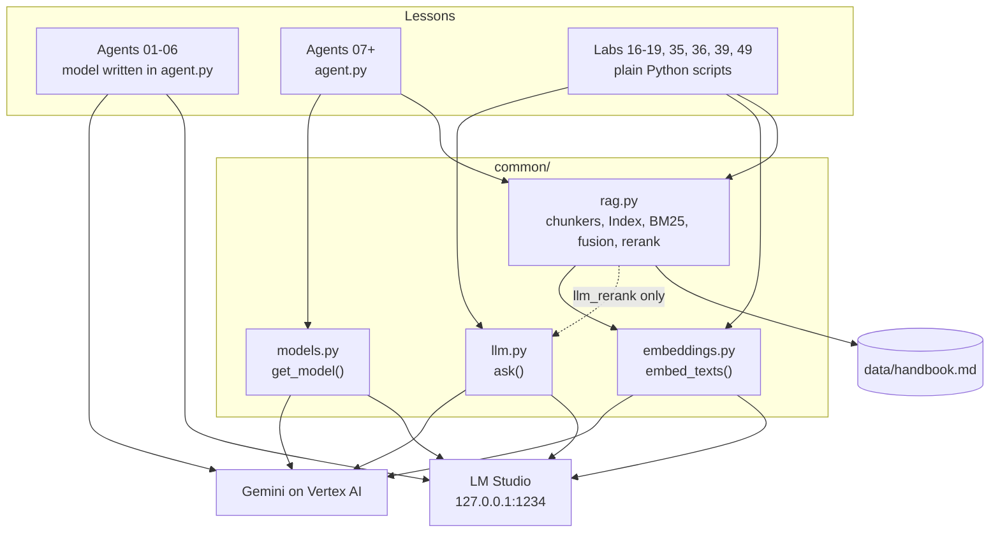
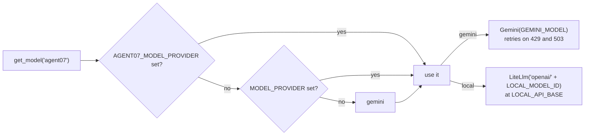
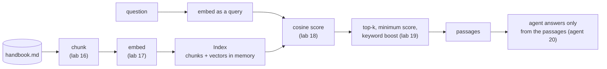

# Architecture

The repository is a set of 50 small, independent lessons that share one thin layer of helper code. There is
no application to deploy and no framework of its own: every lesson is a folder that Google ADK can run
directly.

## Layout

This tutorial is the `google-adk-tutorial` folder of the repository. "Project root" in these pages means that
folder: it is where you run `uv` and where `.env` lives. The LangChain port is the sibling folder
[`langchain-adk-tutorial`](../../langchain-adk-tutorial/README.md).

    agent01_poet/ ... agent50_capstone/   one lesson per folder
    common/                               shared helpers (model switch, direct model calls, embeddings, RAG)
    data/handbook.md                      the sample document every RAG step searches
    tests/                                unit tests that need no model
    docs/                                 this documentation
    questions.md                          the study guide
    .env.example                          the settings to copy into .env
    pyproject.toml, uv.lock               dependencies, managed by uv

## What a lesson folder contains

| File | Purpose |
|---|---|
| `agent.py` | Defines `root_agent`. This is the name ADK looks for. |
| `__init__.py` | Contains `from . import agent`, which makes the folder an ADK agent package. |
| `CASES.md` | The lesson: a diagram of how the agent executes, then cases from easy to hard, each with an "Expect" and a "Learn" line. |
| anything else | Evalsets, test and demo scripts, small servers, sample data. Listed in the [agent catalog](agent-catalog.md). |

`uv run adk run <folder>` imports the folder and chats with its `root_agent`. `uv run adk web`, started from
the project root, lists every folder that has one.

Eight folders are **labs** (16 to 19, 35, 36, 39, 49). They have no `agent.py`; they are scripts you run with
`uv run python <folder>/<script>.py` that print a result to study. They exist because some ideas (chunking,
cosine similarity, measuring cost) are clearer without an agent around them.

## The shared layer

`common/` holds four modules. Each one loads the root `.env` on import, without overriding variables that
are already set, so a value on the command line always wins. Full signatures are in the
[shared code reference](common-api.md).

| Module | Gives you | Used by |
|---|---|---|
| `models.py` | `get_model()`: an ADK model object for Gemini or the local server | Every agent from 07 on |
| `llm.py` | `ask()`: one prompt in, text plus token counts and seconds out, with no agent | Labs 36, 39, 49, agent 37's lab script, and `rag.llm_rerank` (lab 35) |
| `embeddings.py` | `embed_texts()`: text to vectors, cached for the run | Labs 17 to 19, 35, 36, 49 and agents 37, 38, 50 directly; agent 20 through `rag.py` |
| `rag.py` | Chunkers, the in-memory `Index`, `BM25`, rank fusion, LLM reranking | Labs 19, 35, 36, 39 and agents 20, 50 |

### The model switch

Agents 01 to 06 name their model in `agent.py`, because those lessons are about the model itself. From
agent 07 on, every agent asks `get_model()`:

The Gemini object carries retry options (6 attempts, starting at 5 seconds, capped at 60) because Gemini
answers `429 RESOURCE_EXHAUSTED` when many calls arrive quickly. The local model is reached through LiteLLM
using the OpenAI-compatible protocol that LM Studio serves.

The provider is read once, when `agent.py` is imported. Several agents also read their own switches at import
time (for example `DEFENSE` in agent 31), which is why their test scripts set the variable before importing
the agent module.

### The RAG pipeline

Labs 16 to 18 teach chunking, embedding and cosine scoring one step at a time. `common/rag.py` is the
assembled result, which lab 19, agent 20 and the capstone reuse.

The "vector database" is a Python list of chunks and a numpy array, built on the first search and kept for
the life of the process. Lab 35 adds a second retriever (`BM25`), merges the two rankings with reciprocal
rank fusion, and reranks the top candidates with a model.

## Runtime files

Running the agents creates files that are git-ignored on purpose, because they hold conversations or
personal data:

| Path | Created by |
|---|---|
| `.adk/` inside an agent folder | `adk web` sessions and `adk eval` results |
| `agent21_memory/memory.json` | Agent 21's saved memories |
| `agent34_persistent_sessions/sessions.db`, `*.session.json` | Agent 34's session database and saved sessions |
| `*.db` | Any SQLite session store, for example from `adk api_server --session_service_uri` |
| `agent47_batch_processing/results.csv` | Agent 47's batch results |

## Conventions the code follows

- **One new idea per folder.** A lesson changes as little as possible from the one before it.
- **Fake data inside tools.** Tools return fixed demo values (weather, exchange rates, a book catalogue), so
  results are repeatable and no outside service is needed.
- **Tools return a dict with a clear error.** A failing tool returns `{"status": "error", "message": ...}`
  so the model can tell the user what went wrong and does not invent an answer.
- **Docstrings are the tool description.** ADK shows a function's docstring and `Args:` section to the
  model, so they are written for the model to read.
- **`MODEL_KEY`.** Agents from 07 on define `MODEL_KEY = "agentNN"` and pass it to `get_model()`, which is
  what makes `AGENTNN_MODEL_PROVIDER` work.
- **Measured claims.** "Expect" lines in `CASES.md` report what happened when the case was tested. Model
  output varies between runs and between Gemini and the local model.
