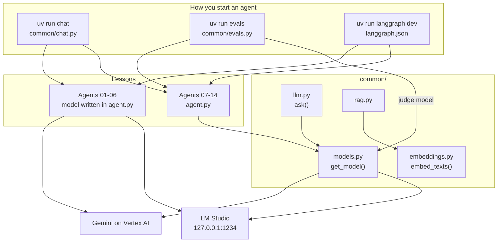
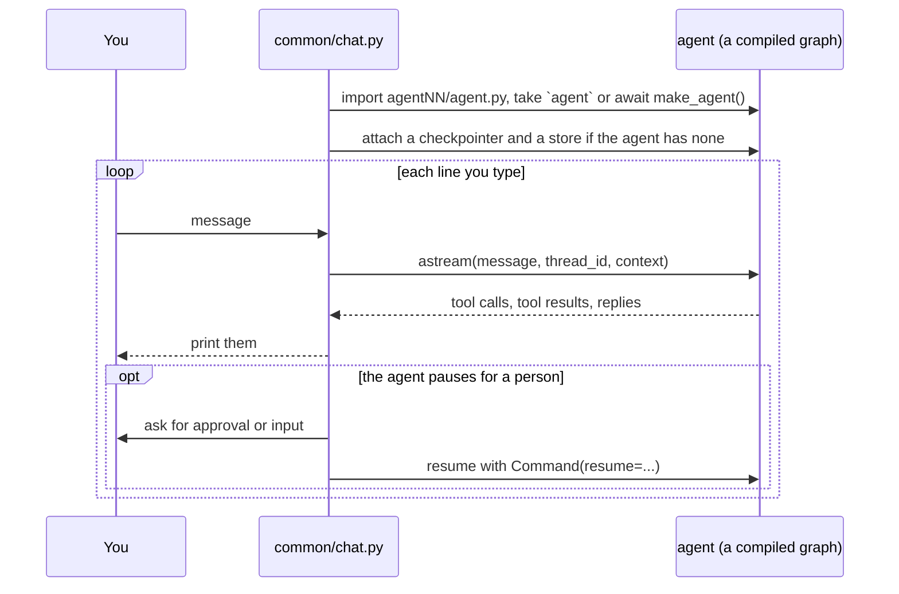
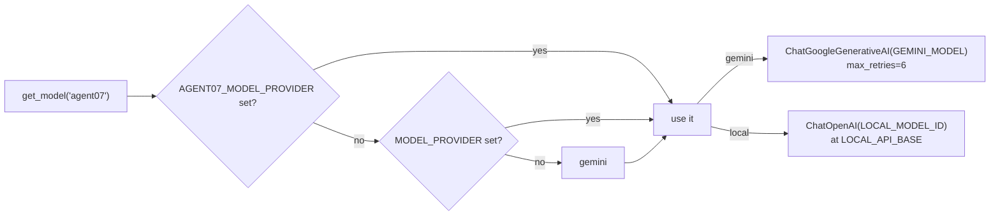

# Architecture

This folder is a set of small, independent lessons that share one thin layer of helper code. It is the
LangChain port of the sibling folder [`google-adk-tutorial`](../../google-adk-tutorial/README.md): the same
agents, topics and cases, built with `langchain` (`create_agent`, middleware) and `langgraph` (graphs,
state, checkpoints).

"Project root" in these pages means the `langchain-adk-tutorial` folder. It is where you run `uv` and where
`.env` lives.

## Layout

    agent01_poet/ ... agent14_agent_as_tool/   one lesson per folder
    common/                                    shared code: model switch, chat runner, eval runner, RAG helpers
    data/handbook.md                           the sample document for the RAG steps
    tests/                                     unit tests that need no model
    docs/                                      this documentation
    langgraph.json                             the agents `langgraph dev` serves
    .env.example                               the settings to copy into .env
    pyproject.toml, uv.lock                    dependencies and the `chat` / `evals` commands

## What a lesson folder contains

| File | Purpose |
|---|---|
| `agent.py` | Defines the agent as a module-level object called `agent`, or an async function `make_agent()` that builds one |
| `__init__.py` | Contains `from . import agent` |
| `CASES.md` | The lesson: a diagram of how the agent executes, then cases from easy to hard, each with an "Expect" and a "Learn" line |
| anything else | Eval sets and configs (agent 13), a small MCP server (agent 12). Listed in the [agent catalog](agent-catalog.md). |

Whatever `agent` is, it is a compiled LangGraph graph. Two ways of making one appear in the tutorial:

- `create_agent(model, system_prompt=..., tools=..., middleware=...)` builds the standard "model calls tools
  in a loop" graph for you. Agents 01 to 06, 11 to 14.
- `StateGraph(...)` with your own nodes and edges, then `.compile()`. Agents 08 to 10 are plain graphs, and
  agent 07 is a graph whose nodes are three `create_agent` agents.

`make_agent()` exists for agents that need async set-up. Agent 12 uses it because asking an MCP server
which tools it has means talking to another process.

## Why there is a chat runner

A LangChain agent is only a graph. It keeps nothing between calls and has no terminal chat command of its
own, so `common/chat.py` supplies what ADK's `adk run` does:

| It adds | What it is | In this tutorial |
|---|---|---|
| A checkpointer | Remembers the conversation (the "thread") between your lines | In memory, so it is lost when you quit |
| A store | Data that outlives one conversation | In memory |
| A context | Facts about the caller that the application decides, such as who is logged in | Built from `--user` and `--set` |

The runner already handles pauses for human approval and input, context values, and streaming, although the
agents that use them (15, 33, 34, 48) are not ported yet. Replies are printed when the turn ends, not as
they are produced, because a guardrail may still replace a reply after the model wrote it (agent 11).

`common/evals.py` reuses the same loader to replay recorded conversations and score them. See
[Evals and tests](evals-and-testing.md).

`uv run langgraph dev` does not use the chat runner. It reads `langgraph.json`, serves each listed graph,
and supplies its own persistence.

## The shared layer

| Module | Gives you | Used by |
|---|---|---|
| `models.py` | `get_model()`: a LangChain chat model for Gemini or the local server. Also loads the root `.env`. | Every agent from 07 on, and the modules below |
| `chat.py` | The `chat` command | You |
| `evals.py` | The `evals` command | Agent 13 |
| `llm.py` | `ask()`: one prompt in, text plus token counts and seconds out, with no agent | Ported ahead for the labs; no agent uses it yet |
| `embeddings.py` | `embed_texts()`: text to vectors, cached for the run | `rag.py` |
| `rag.py` | Chunkers, the in-memory `Index`, `BM25`, rank fusion, LLM reranking | Ported ahead for the RAG steps; covered by `tests/test_rag.py` |

`rag.py`, `data/handbook.md` and `tests/test_rag.py` are identical to the ADK tutorial's copies. `llm.py`
and `embeddings.py` keep the same functions but call the model through LangChain classes.

### The model switch

Agents 01 to 06 name their model in `agent.py`, because those lessons are about the model itself. From
agent 07 on, every agent asks `get_model()`:

LM Studio speaks the OpenAI protocol, so the OpenAI chat class works once it is pointed at the local server.
The provider is read once, when `agent.py` is imported.

## Runtime files

| Path | Created by | Tracked |
|---|---|---|
| `.langgraph_api/` | `langgraph dev`: its threads and state | No, git-ignored |
| `*.db` | Any SQLite checkpointer | No, git-ignored |

## Conventions the code follows

- **One new idea per folder.** A lesson changes as little as possible from the one before it.
- **Same cases as the ADK version.** A port keeps the topic, the tools and the cases, so the two tutorials
  can be read side by side.
- **Fake data inside tools.** Tools return fixed demo values, so results are repeatable and no outside
  service is needed.
- **Tools return a dict with a clear error.** A failing tool returns `{"status": "error", "message": ...}`
  so the model can tell the user what went wrong.
- **Docstrings are the tool description.** The function's docstring and `Args:` section are what the model
  reads.
- **`MODEL_KEY`.** Agents from 07 on define `MODEL_KEY = "agentNN"` and pass it to `get_model()`, which is
  what makes `AGENTNN_MODEL_PROVIDER` work.
- **Measured claims.** "Expect" lines in `CASES.md` report what happened when the case was tested. Model
  output varies between runs and between Gemini and the local model.
